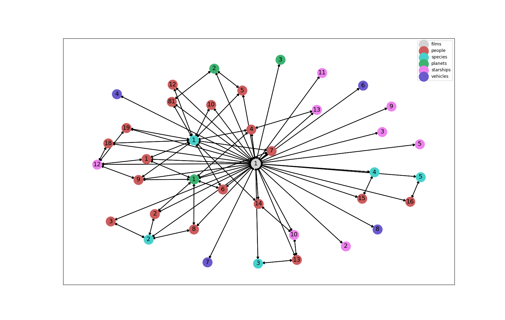

# Conformance Tests

All query conformance tests are run on a subset of the data from [SWAPI](https://swapi.co). The test graph data is [here](./graphs) and the scripts used to generate the graph are [here](./resources).

## Test Graph




## Edges

Edge Type Format: *[src vertex label]-[edge label]-[dest vertex label]*


| Edge Type                    | Count | 
|------------------------------|----| 
| Character-films-Film         | 18 | 
| Character-homeworld-Planet   | 9  | 
| Character-species-Species    | 18 | 
| Character-starships-Starship | 7  | 
| Film-characters-Character    | 18 | 
| Film-planets-Planet          | 3  | 
| Film-species-Species         | 5  | 
| Film-starships-Starship      | 8  | 
| Film-vehicles-Vehicle        | 4  | 
| Planet-films-Film            | 3  | 
| Planet-residents-Character   | 9  | 
| Species-films-Film           | 5  | 
| Species-people-Character     | 18 | 
| Starship-films-Film          | 8  | 
| Starship-pilots-Character    | 7  | 
| Vehicle-films-Film           | 4  | 

## Schema

### Character

```
{
  "title": "Character",
  "description": "A character within the Star Wars universe",
  "properties": {
    "eye_color": {
      "type": "string",
      "description": "The eye color of this person."
    },
    "birth_year": {
      "type": "string",
      "description": "The birth year of this person. BBY (Before the Battle of Yavin) or ABY (After the Battle of Yavin)."
    },
    "gender": {
      "type": "string",
      "description": "The gender of this person (if known)."
    },
    "hair_color": {
      "type": "string",
      "description": "The hair color of this person."
    },
    "name": {
      "type": "string",
      "description": "The name of this person."
    },
    "url": {
      "type": "string",
      "description": "The url of this resource",
      "format": "uri"
    },
    "height": {
      "type": "number",
      "description": "The height of this person in meters."
    },
    "mass": {
      "type": "number",
      "description": "The mass of this person in kilograms."
    },
    "skin_color": {
      "type": "string",
      "description": "The skin color of this person."
    },
    "system": {
      "created": {
        "type": "string",
        "description": "The ISO 8601 date format of the time that this resource was created.",
        "format": "date-time"
      },
      "edited": {
        "type": "string",
        "description": "the ISO 8601 date format of the time that this resource was edited.",
        "format": "date-time"
      }
    }
  },
  "type": "object",
  "$schema": "http://json-schema.org/draft-04/schema",
}
```

### Film
```
{
  "title": "Film",
  "description": "A Star Wars film",
  "properties": {
    "title": {
      "type": "string",
      "description": "The title of this film."
    },
    "producer": {
      "type": "array",
      "description": "The producer(s) of this film."
    },
    "release_date": {
      "type": "string",
      "description": "The release date at original creator country.",
      "format": "date"
    },
    "url": {
      "type": "string",
      "description": "The url of this resource",
      "format": "uri"
    },
    "director": {
      "type": "string",
      "description": "The director of this film."
    },
    "episode_id": {
      "type": "integer",
      "description": "The episode number of this film."
    },
    "opening_crawl": {
      "type": "string",
      "description": "The opening crawl text at the beginning of this film."
    },
    "system": {
      "created": {
        "type": "string",
        "description": "The ISO 8601 date format of the time that this resource was created.",
        "format": "date-time"
      },
      "edited": {
        "type": "string",
        "description": "the ISO 8601 date format of the time that this resource was edited.",
        "format": "date-time"
      }
    }
  },
  "type": "object",
  "$schema": "http://json-schema.org/draft-04/schema",
}
```

### Planet
```
{
  "title": "Planet",
  "description": "A planet.",
  "properties": {
    "url": {
      "type": "string",
      "description": "The hypermedia URL of this resource.",
      "format": "uri"
    },
    "population": {
      "type": "number",
      "description": "The average population of sentient beings inhabiting this planet."
    },
    "name": {
      "type": "string",
      "description": "The name of this planet."
    },
    "surface_water": {
      "type": "number",
      "description": "The percentage of the planet surface that is naturally occuring water or bodies of water."
    },
    "orbital_period": {
      "type": "number",
      "description": "The number of standard days it takes for this planet to complete a single orbit of its local star."
    },
    "diameter": {
      "type": "number",
      "description": "The diameter of this planet in kilometers."
    },
    "gravity": {
      "type": "number",
      "description": "A number denoting the gravity of this planet. Where 1 is normal."
    },
    "climate": {
      "type": "array",
      "description": "The climate(s) of this planet."
    },
    "terrain": {
      "type": "array",
      "description": "the terrain(s) of this planet"
    },
    "rotation_period": {
      "type": "number",
      "description": "The number of standard hours it takes for this planet to complete a single rotation on its axis."
    },
    "system": {
      "created": {
        "type": "string",
        "description": "The ISO 8601 date format of the time that this resource was created.",
        "format": "date-time"
      },
      "edited": {
        "type": "string",
        "description": "the ISO 8601 date format of the time that this resource was edited.",
        "format": "date-time"
      }
    }
  },
  "type": "object",
  "$schema": "http://json-schema.org/draft-04/schema",
}
```

### Species
```
{
  "title": "Species",
  "description": "A species within the Star Wars universe",
  "properties": {
    "eye_colors": {
      "type": "array",
      "description": "Common eye colors for this species, none if this species does not typically have eyes."
    },
    "classification": {
      "type": "string",
      "description": "The classification of this species."
    },
    "name": {
      "type": "string",
      "description": "The name of this species."
    },
    "language": {
      "type": "string",
      "description": "The language commonly spoken by this species."
    },
    "url": {
      "type": "string",
      "description": "The hypermedia URL of this resource.",
      "format": "uri"
    },
    "designation": {
      "type": "string",
      "description": "The designation of this species."
    },
    "average_lifespan": {
      "type": "number",
      "description": "The average lifespan of this species in years."
    },
    "skin_colors": {
      "type": "array",
      "description": "Common skin colors for this species, none if this species does not typically have skin."
    },
    "hair_colors": {
      "type": "array",
      "description": "Common hair colors for this species, none if this species does not typically have hair."
    },
    "average_height": {
      "type": "number",
      "description": "The average height of this person in centimeters."
    },
    "system": {
      "created": {
        "type": "string",
        "description": "The ISO 8601 date format of the time that this resource was created.",
        "format": "date-time"
      },
      "edited": {
        "type": "string",
        "description": "the ISO 8601 date format of the time that this resource was edited.",
        "format": "date-time"
      }
    }
  },
  "type": "object",
  "$schema": "http://json-schema.org/draft-04/schema",
}
```

### Starship
```
{
  "title": "Starship",
  "description": "A Starship",
  "properties": {
    "url": {
      "type": "string",
      "description": "The hypermedia URL of this resource.",
      "format": "uri"
    },
    "MGLT": {
      "type": "string",
      "description": "The Maximum number of Megalights this starship can travel in a standard hour. A Megalight is a standard unit of distance and has never been defined before within the Star Wars universe. This figure is only really useful for measuring the difference in speed of starships. We can assume it is similar to AU, the distance between our Sun (Sol) and Earth."
    },
    "passengers": {
      "type": "number",
      "description": "The number of non-essential people this starship can transport."
    },
    "starship_class": {
      "type": "string",
      "description": "The class of this starship, such as Starfighter or Deep Space Mobile Battlestation."
    },
    "model": {
      "type": "string",
      "description": "The model or official name of this starship. Such as T-65 X-wing or DS-1 Orbital Battle Station."
    },
    "name": {
      "type": "string",
      "description": "The name of this starship. The common name, such as Death Star."
    },
    "length": {
      "type": "number",
      "description": "The length of this starship in meters."
    },
    "consumables": {
      "type": "string",
      "description": "The maximum length of time that this starship can provide consumables for its entire crew without having to resupply."
    },
    "crew": {
      "type": "number",
      "description": "The number of personnel needed to run or pilot this starship."
    },
    "cost_in_credits": {
      "type": "number",
      "description": "The cost of this starship new, in galactic credits."
    },
    "max_atmosphering_speed": {
      "type": "number",
      "description": "The maximum speed of this starship in atmosphere. n/a if this starship is incapable of atmosphering flight."
    },
    "hyperdrive_rating": {
      "type": "number",
      "description": "The class of this starships hyperdrive."
    },
    "cargo_capacity": {
      "type": "number",
      "description": "The maximum number of kilograms that this starship can transport."
    },
    "manufacturer": {
      "type": "array",
      "description": "The manufacturer of this vehicle."
    },
    "system": {
      "created": {
        "type": "string",
        "description": "The ISO 8601 date format of the time that this resource was created.",
        "format": "date-time"
      },
      "edited": {
        "type": "string",
        "description": "the ISO 8601 date format of the time that this resource was edited.",
        "format": "date-time"
      }
    }
  },
  "type": "object",
  "$schema": "http://json-schema.org/draft-04/schema",
}
```

### Vehicle
```
{
  "title": "Vehicle",
  "description": "A vehicle.",
  "properties": {
    "url": {
      "type": "string",
      "description": "The hypermedia URL of this resource.",
      "format": "uri"
    },
    "passengers": {
      "type": "number",
      "description": "The number of non-essential people this vehicle can transport."
    },
    "model": {
      "type": "string",
      "description": "The model or official name of this vehicle. Such as All Terrain Attack Transport."
    },
    "name": {
      "type": "string",
      "description": "The name of this vehicle. The common name, such as Sand Crawler."
    },
    "length": {
      "type": "number",
      "description": "The length of this vehicle in meters."
    },
    "crew": {
      "type": "number",
      "description": "The number of personnel needed to run or pilot this vehicle."
    },
    "cost_in_credits": {
      "type": "number",
      "description": "The cost of this vehicle new, in galactic credits."
    },
    "max_atmosphering_speed": {
      "type": "number",
      "description": "The maximum speed of this vehicle in atmosphere."
    },
    "consumables": {
      "type": "string",
      "description": "The maximum length of time that this vehicle can provide consumables for its entire crew without having to resupply."
    },
    "cargo_capacity": {
      "type": "number",
      "description": "The maximum number of kilograms that this vehicle can transport."
    },
    "vehicle_class": {
      "type": "string",
      "description": "The class of this vehicle, such as Wheeled."
    },
    "manufacturer": {
      "type": "array",
      "description": "The manufacturer of this vehicle."
    },
    "system": {
      "created": {
        "type": "string",
        "description": "The ISO 8601 date format of the time that this resource was created.",
        "format": "date-time"
      },
      "edited": {
        "type": "string",
        "description": "the ISO 8601 date format of the time that this resource was edited.",
        "format": "date-time"
      }
    }
  },
  "type": "object",
  "$schema": "http://json-schema.org/draft-04/schema",
}
```

# Notes

Read/Write API operations may use another data source. 
